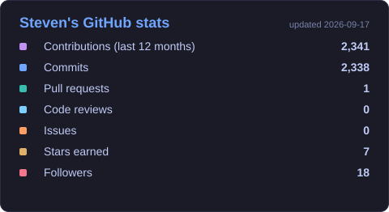
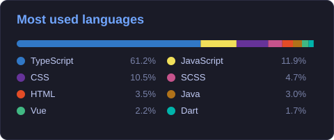

 

 

## 👨‍💻 About me

I build **end-to-end TypeScript products**: React / Next.js and Angular front-ends on NestJS and Java back-ends, deployed on AWS — and I use AI as a velocity lever, not a buzzword.

- 🏢 **Fullstack Engineer @ Inelys** — internal CRM (business modules, roles & permissions) and an **AI-agents platform**: isolated workers, GitHub Actions / Jira webhooks, job queue, run tracking, subscription billing (Stripe, S3, Resend).
- 🚀 **CTO & solo builder of [Shiiift](https://shiiift.ai)** — B2B SaaS that monitors how brands show up across LLMs (ChatGPT, Claude, Perplexity, Gemini…) and generates content to improve it. Built on evenings & weekends.
- ⚡ Proudest win: a data pipeline for **EDF** (via Sopra Steria) brought from **45 min to 2 min** (−95 %), plus an **Angular 16 → 21** migration (standalone components, Signals) and 150+ endpoints hardened.
- 📍 Grenoble, France · full remote · open to senior fullstack / product engineer roles, CDI or freelance.

 

## 🛠️ Stack

**Front-end**

**Back-end**

**Data, infra & tooling**

Also worked with: Vue / Nuxt · Flutter · Laravel / Symfony · Firebase · MultiversX (Web3)

 

## 🚀 Featured projects

| Project | What it is | Stack |
|---|---|---|
| **[Shiiift](https://shiiift.ai)** | LLM brand-visibility monitoring SaaS — multi-model crawling, scoring, content generation. Solo-built from scratch. | Next.js · NestJS · PostgreSQL · AWS |
| **[Mafia-Story-Generator](https://github.com/theejkb/Mafia-Story-Generator)** | Generates a personal story + image for each of 5 555 NFTs of a MultiversX collection. | TypeScript · MultiversX SDK |
| **[elrond-treasure-hunt](https://github.com/theejkb/elrond-treasure-hunt)** | Event app rallying 24 Web3 projects — users hunt hidden words across platforms to unlock rewards. | TypeScript · MultiversX |

 

## 📊 GitHub

  

 

  

 

  Made with ☕ in Grenoble · <a href="https://stevencopy.dev">stevencopy.dev</a>

